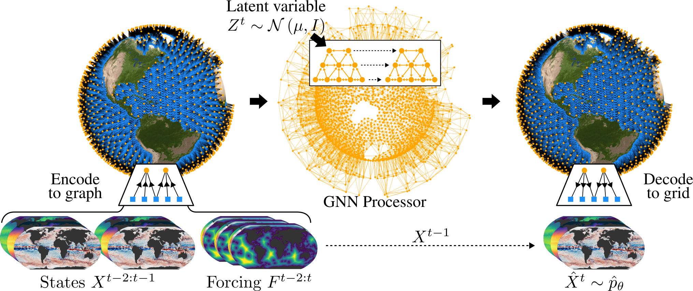
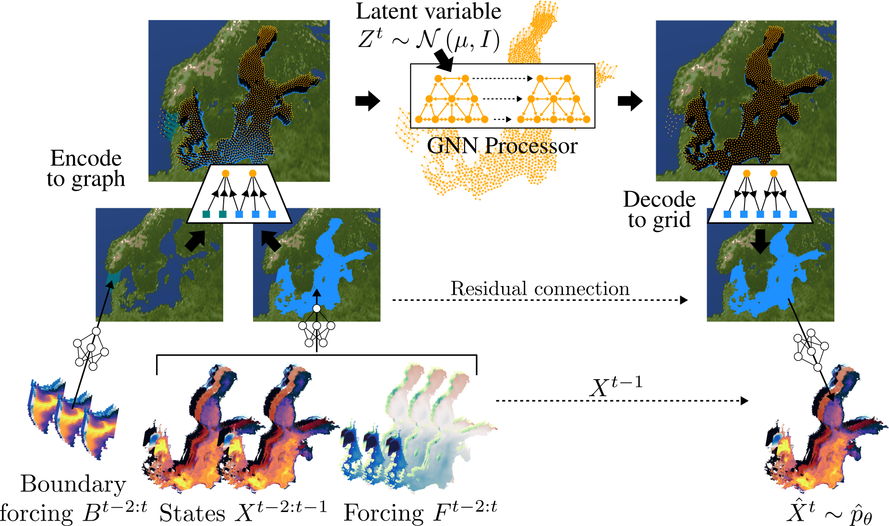

[](https://arxiv.org/abs/2605.15470)
[](https://github.com/deinal/njord/actions/workflows/pre-commit.yml)
[](https://github.com/deinal/njord/actions/workflows/install-and-test.yml)

# Njord

This repository contains graph-based neural models for ensemble ocean forecasting, for global and regional domains.
The implementation is based on [mllam/neural-lam](https://github.com/mllam/neural-lam).
Training-ready datasets are built with [mllam-data-prep](https://github.com/mllam/mllam-data-prep).
The code uses [PyTorch](https://pytorch.org/) and [PyTorch Lightning](https://lightning.ai/pytorch-lightning).
Graph Neural Networks are implemented using [PyG](https://pyg.org/) and logging is set up through [Weights & Biases](https://wandb.ai/) or [MLflow](https://mlflow.org/).

Relative to Neural-LAM, graphs are built on sea points only (land / bathymetry masks), regional runs take lateral boundary and atmospheric forcing, and variable ranges can be restricted (e.g. `siconc` in `[0, 1]`, `sithick ≥ 0`).
Mesh construction uses spherical or Euclidean k-means over sea points with Delaunay edges filtered for land crossings, and can be connected to different grids (transition from reanalysis to analysis bathymetry) by swapping G2M, M2G edges.

<p align="middle">
    
</p>
<p align="middle">
    <em>One-step prediction in Njord. Two previous ocean states <code>X<sup>t−2:t-1</sup></code> and atmospheric forcing <code>F<sup>t−2:t</sup></code> are encoded onto a hierarchical mesh over sea points only. A latent variable <code>Z<sup>t</sup></code> is injected in the GNN processor; the decoder maps back to the grid and adds a residual to <code>X<sup>t−1</sup></code>, producing a sample from the one-step forecast distribution.</em>
</p>

---

<p align="middle">
    
</p>
<p align="middle">
    <em>One-step prediction in Njord-Baltic. The same latent-variable GNN is used on a Baltic cluster mesh, with additional lateral boundary forcing <code>B<sup>t−2:t</sup></code> from a global ocean model and atmospheric forcing <code>F<sup>t−2:t</sup></code>.</em>
</p>

# Publications

*If you use this code, please cite the relevant paper(s).*

#### [Njord: A Probabilistic Graph Neural Network for Ensemble Ocean Forecasting](https://arxiv.org/abs/2605.15470)
```
@article{holmberg2026njord,
  title={Njord: A Probabilistic Graph Neural Network for Ensemble Ocean Forecasting},
  author={Holmberg, Daniel and Oskarsson, Joel and Wikingsson, Erik and Lindsten, Fredrik and Roos, Teemu},
  journal={arXiv preprint arXiv:2605.15470},
  year={2026}
}
```

#### [Accurate Mediterranean Sea forecasting via graph-based deep learning](https://www.nature.com/articles/s41598-025-31177-w)
```
@article{holmberg2025accurate,
  title={Accurate Mediterranean Sea forecasting via graph-based deep learning},
  author={Holmberg, Daniel and Clementi, Emanuela and Epicoco, Italo and Roos, Teemu},
  journal={Scientific Reports},
  volume={15},
  number={1},
  pages={45051},
  year={2025}
}
```

#### [Regional Ocean Forecasting with Hierarchical Graph Neural Networks](https://www.climatechange.ai/papers/neurips2024/51)
```
@inproceedings{holmberg2024regional,
    title={Regional Ocean Forecasting with Hierarchical Graph Neural Networks},
    author={Holmberg, Daniel and Clementi, Emanuela and Roos, Teemu},
    booktitle={NeurIPS 2024 Workshop on Tackling Climate Change with Machine Learning},
    year={2024}
}
```

Cite [Oskarsson et al. (2024)](https://arxiv.org/abs/2406.04759) if you rely on the Graph-EFM weather model rather than the ocean-specific changes.

# Installing Njord

When installing you have a choice of either installing with `pip` or using the `pdm` package manager.
We recommend `pdm`.

`torch` is a required dependency, but it ships separate variants for CPU-only and each CUDA version. Install the variant you want first (see instructions below), then the rest of the project.

#### Using `pdm`

1. Clone this repository and navigate to the root directory.
2. Install `pdm` if you don't have it installed on your system (either with `pip install pdm` or [following the install instructions](https://pdm-project.org/latest/#installation)).
> If you are happy using the latest version of `torch` with GPU support (expecting the latest version of CUDA is installed on your system) you can skip to step 5.
3. Create a virtual environment for pdm to use with `pdm venv create --with-pip`.
4. Install a specific version of `torch` with `pdm run python -m pip install torch --index-url https://download.pytorch.org/whl/cpu` for a CPU-only version or `pdm run python -m pip install torch --index-url https://download.pytorch.org/whl/cu128` for CUDA 12.8 support (you can find the correct URL for the variant you want on the [PyTorch webpage](https://pytorch.org/get-started/locally/)).
5. Install the dependencies with `pdm install`. If you will be developing Njord we recommend to install the development dependencies with `pdm install --group dev`. By default `pdm` installs the package in editable mode, so you can make changes to the code and see the effects immediately.

#### Using `pip`

1. Clone this repository and navigate to the root directory.
> If you are happy using the latest version of `torch` with GPU support (expecting the latest version of CUDA is installed on your system) you can skip to step 3.
2. Install a specific version of `torch` with `python -m pip install torch --index-url https://download.pytorch.org/whl/cpu` for a CPU-only version or `python -m pip install torch --index-url https://download.pytorch.org/whl/cu128` for CUDA 12.8 support (you can find the correct URL for the variant you want on the [PyTorch webpage](https://pytorch.org/get-started/locally/)).
3. Install the dependencies with `python -m pip install .`. If you will be developing Njord we recommend to install in editable mode and install the development dependencies with `python -m pip install -e ".[dev]"` so you can make changes to the code and see the effects immediately.

# Quickstart

A small subset of the data is available for easy experimentation. Download with:
```
from huggingface_hub import snapshot_download

snapshot_download(
    repo_id="deinal/njord-sample-data",
    repo_type="dataset",
    local_dir="sample_data"
)
```

Training can then be run immediately on the preprocessed data with readily available graphs:
```
python -m neural_lam.train_model \
    --config_path sample_data/global_ocean_1.yaml \
    --num_workers 1 \
    --precision bf16-mixed \
    --model graph_fm \
    --graph global_hierarchical_graph \
    --hidden_dim 16 \
    --hidden_dim_grid 8 \
    --hidden_dim_mesh_nodes 8 \
    --hidden_dim_edge 4 \
    --processor_layers 3 \
    --batch_size 1 \
    --lr 0.001 \
    --ar_steps_eval 2 \
    --val_steps_to_log 1 2 \
    --num_sanity_val_steps 0 \
    --num_nodes 1
```

For more commands see:
```
python -m neural_lam.train_model --help
```

## Graph visualization

```
python -m neural_lam.plot_global_graph_3d \
    --config_path sample_data/global_ocean_1.yaml \
    --graph_name global_cluster_graph \
    --save global_cluster_graph.html
```

# Using Njord

Once installed you will be able to train and evaluate models. For this you will in general need two things:

1. **Data to train/evaluate the model**, represented as a *datastore* (see [Data](#data-the-datastore-and-weatherdataset-classes)).
 A datastore loads fields from disk (here: zarr written by mllam-data-prep) and exposes them to Neural-LAM.
 A datastore is used to create a `pytorch.Dataset`-derived class that samples the data in time.

2. **The graph structure** used to define message-passing GNN layers.
 The graph is created for a specific datastore.

Any command you run includes the path to a configuration file (usually something like `data/baltic_sea_finetune.yaml`).
This file names the datastore(s) to use and training options such as loss weights and output clamping.
The parent directory of that file is the run root: graphs are stored under `<root>/graphs/`.

Example contents of a regional config:

```yaml
datastore:
  kind: mdp
  config_path: baltic_sea_ft_mdp_config.yaml
datastore_boundary:
  kind: mdp
  config_path: baltic_boundary_ft_mdp_config.yaml
datastore_atmosphere:
  kind: mdp
  config_path: baltic_era5_ft_mdp_config.yaml
training:
  state_feature_weighting:
    __config_class__: ManualStateFeatureWeighting
    weights:
      sla: 0.5
      siconc: 0.5
      sithick: 0.5
      thetao_1m: 0.2
  output_clamping:
    upper:
      siconc: 1.0
    lower:
      siconc: 0.0
      sithick: 0.0
  density_channel:
    reference_var: siconc
    associated_vars:
      - siconc
      - sithick
```

Optional keys `statistics_datastore`, `statistics_datastore_boundary` and `statistics_datastore_atmosphere` point at separate MDP configs whose mean/std are used for normalisation.
That is useful when training or evaluating on forecast tensors (`init_time` × `lead_time`) while still normalising with statistics from a longer reanalysis/analysis record.
See [`data/baltic_sea_finetune.yaml`](data/baltic_sea_finetune.yaml) (analysis along `time`) and [`data/baltic_sea_forecasts.yaml`](data/baltic_sea_forecasts.yaml) (forecasts + `statistics_*`).
Paths inside those files are machine-specific.

Ocean, atmosphere and boundary fields used here go through [mllam-data-prep](https://github.com/mllam/mllam-data-prep).
Typical sources are Copernicus Marine ocean products, ERA5 for training-time atmosphere, and IFS/AIFS for forecast evaluation.

## Data (the `DataStore` and `WeatherDataset` classes)

The input-data representation is split into two parts, as in Neural-LAM:

1. A datastore (`neural_lam.datastore.BaseDatastore`) which loads a given category (state, forcing or static) and split (train/val/test) from disk and returns an `xarray.DataArray`.
 Spatial coordinates are flattened into `grid_index` and variables stacked into `{category}_feature`.
 The datastore also provides names/units, masks, normalisation values and grid information.
 For the ocean this includes a surface sea/land mask and per-variable bathymetry masks.

2. `neural_lam.weather_dataset.WeatherDataset`, a `pytorch.Dataset` that samples in time, normalises, and returns `torch.Tensor` objects.

The datastore implemented here is `neural_lam.datastore.MDPDatastore`, which reads training-ready zarr written by [mllam-data-prep](https://github.com/mllam/mllam-data-prep).
The npy/MEPS datastore from Neural-LAM is not included.

From an MDP config named `baltic_sea_ft_mdp_config.yaml` the resulting dataset is stored in `baltic_sea_ft_mdp_config.zarr`.
You can also run mllam-data-prep directly:

```bash
python -m mllam_data_prep --config data/baltic_sea_ft_mdp_config.yaml
```

If you will be working on a large dataset (on the order of 10GB or more) it can help to produce the zarr before training, in parallel, by passing `--dask-distributed-local-core-fraction` (see the [mllam-data-prep README](https://github.com/mllam/mllam-data-prep?tab=readme-ov-file#creating-large-datasets-with-daskdistributed)).

To use another on-disk format, subclass `neural_lam.datastore.BaseDatastore` or `BaseRegularGridDatastore` and implement the abstract methods.

### Graph creation

Regional (Lambert) graphs, including optional boundary and atmosphere nodes:

```bash
python -m neural_lam.create_graph --config_path data/baltic_sea_finetune.yaml --help
```

Example cluster mesh (refinement 9 matches a 3×3 quadrilateral coarsening):

```bash
python -m neural_lam.create_graph \
    --config_path data/baltic_sea_finetune.yaml \
    --name cluster \
    --type cluster \
    --levels 3 \
    --grid_to_first_mesh_refinement 9 \
    --mesh_refinement_factor 9 \
    --plot \
    --connect_disconnected
```

Global graphs (spherical k-means / icosahedral):

```bash
python -m neural_lam.create_global_graph --config_path data/global_ocean.yaml --help
```

`python -m neural_lam.create_auxiliary_graph` rebuilds only grid–mesh edges (`g2m` / `m2g`) for a new grid while keeping an existing mesh.
That is used when transferring a mesh trained at one resolution (e.g. 1°) to another (e.g. 0.25°).

`--plot` writes overview figures while the graph is built.
Interactive 3D plots: `python -m neural_lam.plot_graph_3d` and `python -m neural_lam.plot_global_graph_3d`.

Graph files are stored under `graphs/<name>/`. Hierarchical graphs keep per-level lists for mesh edges and features; `mesh_up_*` / `mesh_down_*` connect consecutive levels (lists of length `L-1`).

## Logging your experiments

### Weights & Biases Integration
The project is integrated with [Weights & Biases](https://www.wandb.ai/) (W&B) for logging and visualization, but can just as easily be used without it.
When W&B is used, training configuration, training/test statistics and plots are sent to the W&B servers.
If W&B is turned off, logging instead saves everything locally under the run directory.
See the [W&B documentation](https://docs.wandb.ai/) for details.

If you would like to login and use W&B, run:
```
wandb login
```
If you would like to turn off W&B and just log things locally, run:
```
wandb off
```

### MLFlow Integration
MLFlow is not used by default, but can be switched to by setting `--logger mlflow`.
Set `MLFLOW_TRACKING_URI` to the tracking server. See the [MLFlow documentation](https://mlflow.org/docs/latest/index.html).

## Train Models
Models can be trained using `python -m neural_lam.train_model --config_path <config_path>`.
Run `python -m neural_lam.train_model --help` for a full list of training options.
A few of the key ones are outlined below:

* `--config_path`: Path to the configuration (for example `data/baltic_sea_finetune.yaml`).
* `--model`: Which model to train
* `--graph`: Which graph to use with the model
* `--processor_layers`: Number of GNN layers in the processor
* `--ar_steps_train`: Number of time steps to unroll when computing the loss
* `--ar_steps_eval`: Number of time steps to unroll during validation
* `--kl_beta` / `--crps_weight`: Graph-EFM loss weights (see below)
* `--load`: Checkpoint to continue from

Checkpoints of trained models are stored under `saved_models/`.
The implemented models include:

### Graph-EFM (`graph_efm`)
Probabilistic encode–process–decode model with a latent variable at each forecast step (Njord).
It is trained in stages rather than in a single job.
Example scripts are in `training_scripts/graph_efm/` (`graph_efm_1.sh`–`graph_efm_4.sh`):

1. Autoencoder (`--kl_beta 0 --crps_weight 0 --ar_steps_train 1`): learn to encode/decode; the prior is not trained.
2. One-step ELBO (`--kl_beta 0.1` or similar): train prior and variational posterior together.
 If the model collapses to deterministic forecasts, reduce `--kl_beta`. If prior samples look unreasonable, increase it.
3. Unrolled ELBO (`--ar_steps_train` > 1): same as the previous step, rolled out over multiple steps.
4. CRPS finetune (`--crps_weight` large, still unrolled): calibration of ensemble spread.
 If spread-skill does not improve, increase `--crps_weight`; if spatially incoherent artefacts appear, decrease it.

A later analysis / higher-resolution finetune is typically a separate run with a different YAML (and globally an auxiliary graph).

To train Graph-EFM use
```
python -m neural_lam.train_model --model graph_efm --graph cluster ...
```

### Graph-FM (`graph_fm`)
Deterministic hierarchical GNN (SeaCast baseline), trained with weighted MSE.
Scripts: `training_scripts/seacast/`.

To train Graph-FM use
```
python -m neural_lam.train_model --model graph_fm --graph cluster ...
```

### GraphCast (`graphcast`)
Non-hierarchical encode–process–decode model.

To train GraphCast use
```
python -m neural_lam.train_model --model graphcast --graph 1level ...
```

Checkpoint files for the paper models are available upon request.

### High Performance Computing

The training script can be run on a cluster with multiple GPU-nodes.
Neural-LAM is set up to use PyTorch Lightning's `DDP` backend.
If the cluster has multiple nodes, set the `--num_nodes` argument accordingly (with Slurm, `--num_nodes $SLURM_JOB_NUM_NODES`).
Example job scripts with site-specific paths are under `training_scripts/`.

When using a system without Slurm, where all GPUs are visible, it is possible to select a subset with `--devices`, e.g. `--devices 0 1`.

## Evaluate Models
Evaluation is also done using `python -m neural_lam.train_model --config_path ...`, but using the `--eval` option.
Use `--eval val` to evaluate the model on the validation set and `--eval test` to evaluate on test data.
Most of the training options are also relevant for evaluation.
Some options specifically important for evaluation are:

* `--load`: Path to model checkpoint file (`.ckpt`) to load parameters from
* `--n_example_pred`: Number of example predictions to plot during evaluation
* `--ar_steps_eval`: Number of time steps to unroll for during evaluation

**Note:** While it is technically possible to use multiple GPUs for running evaluation, this is strongly discouraged.
If using multiple devices the `DistributedSampler` will replicate some samples to make sure all devices have the same batch size, meaning that evaluation metrics will be unreliable.
This issue stems from PyTorch Lightning. See for example [this PR](https://github.com/Lightning-AI/torchmetrics/pull/1886) for more discussion.

# Contact
If you have questions about the implementation or ideas for extending it, feel free to get in touch:
[daniel.holmberg@helsinki.fi](mailto:daniel.holmberg@helsinki.fi), or open a GitHub issue.
